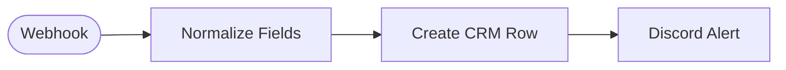

# Contact Form Team Alert

Receives a contact form submission via webhook, creates a Baserow CRM row, and posts a summary to Discord.

<!-- picker: Capture form leads into a CRM and alert the team -->

## Use Case

Keep your contact history in Baserow while getting an instant Discord alert for every new inquiry — distinct from [Lead Capture to Baserow](../lead-capture-to-baserow/), which confirms to the *submitter* instead of alerting your *team*. Use this one when the priority is "someone on the team sees this immediately."

## Required Credentials

- **Baserow API Key** — write access to your contacts table
- **Discord Webhook** — post access to your alerts channel

## Node Overview

| Node | Type | Purpose |
|------|------|---------|
| Webhook | `n8n-nodes-base.webhook` | Receives POST from the contact form |
| Normalize Fields | `n8n-nodes-base.set` | Maps name/full_name and phone/telephone aliases; defaults source to 'website' |
| Create CRM Row | `n8n-nodes-base.baserow` | Creates a row in your Baserow contacts table |
| Discord Alert | `n8n-nodes-base.discord` | Posts a summary to a Discord channel via webhook |

## Flow Diagram

<!-- FLOW_DIAGRAM:START -->

<!-- FLOW_DIAGRAM:END -->

## Configuration

After importing:

1. **Normalize Fields** — if your form sends different field names (e.g. `full_name` instead of `name`), update the fallback aliases in this Set node.
2. **Webhook node** — copy the webhook URL and point your form to it
3. **Create CRM Row** — replace `REPLACE_WITH_YOUR_BASEROW_TABLE_ID` with your contacts table's ID; ensure it has columns: `Name`, `Email`, `Phone`, `Source`, `Message`, `Created At`
4. **Discord Alert** — create a webhook in your Discord server (**Server Settings → Integrations → Webhooks → New Webhook**) and use its URL for the credential
5. Connect credentials: Baserow account, Discord Webhook

## Example

**Input:**
```json
{
  "name": "Nikos Georgiou",
  "email": "nikos@example.com",
  "phone": "+30 694 0000000",
  "message": "Can you help automate our invoicing?"
}
```

**Result:**
- New row created in your Baserow contacts table with all fields populated
- Discord message posted: _"📬 **New contact form submission** — **Name:** Nikos Georgiou — **Email:** nikos@example.com — **Message:** Can you help automate our invoicing?"_
