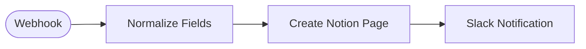

# Contact Form to Notion

Receives a contact form submission via webhook, creates a Notion database page, and posts a summary to a Slack channel.

<!-- picker: Capture form leads into a CRM (via Notion) -->

## Use Case

Keep your entire contact history inside Notion while getting instant Slack alerts for every new inquiry. Ideal if your team already uses Notion as a lightweight CRM and Slack for internal comms.

## Required Credentials

- **Notion Integration Token** — write access to your contacts database
- **Slack API** — post access to your notification channel

## Node Overview

| Node | Type | Purpose |
|------|------|---------|
| Webhook | `n8n-nodes-base.webhook` | Receives POST from the contact form |
| Normalize Fields | `n8n-nodes-base.set` | Maps name/full_name and phone/telephone aliases; defaults source to 'website' |
| Create Notion Page | `n8n-nodes-base.notion` | Creates a page in your Notion contacts database |
| Slack Notification | `n8n-nodes-base.slack` | Posts a summary card to a Slack channel |

## Flow Diagram

<!-- FLOW_DIAGRAM:START -->

<!-- FLOW_DIAGRAM:END -->

## Configuration

After importing:

1. **Normalize Fields** — if your form sends different field names (e.g. `full_name` instead of `name`), update the fallback aliases in this Set node.
2. **Webhook node** — copy the webhook URL and point your form to it
3. **Create Notion Page** — replace `YOUR_NOTION_DATABASE_ID` with your database ID (from the Notion URL: `notion.so/<database_id>?v=...`)
4. **Create Notion Page** — ensure your Notion database has properties named `Email`, `Phone`, `Source`, `Message` (types: email, phone_number, select, rich_text respectively). Add the Notion integration to the database via the database's **Connections** settings.
5. **Slack Notification** — change `#contacts` to your preferred channel name
6. Connect credentials: Notion account, Slack account

## Example

**Input:**
```json
{
  "name": "Nikos Georgiou",
  "email": "nikos@example.com",
  "phone": "+30 694 0000000",
  "message": "Can you help automate our invoicing?"
}
```

**Result:**
- New Notion page created: _"Nikos Georgiou — 22/04/2026"_ with all fields populated
- Slack message posted to `#contacts` with name, email, and a link to the Notion page
