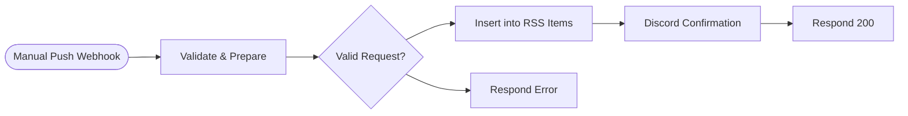

# StackSignal Manual RSS Push

A token-authenticated webhook for manually queuing a one-off newsletter draft — for when you want to publish something outside the automated weekly cycle.

<!-- picker: Manually queue a one-off newsletter draft via API -->

## Use Case

The weekly draft generator runs on a schedule; sometimes you want to push a draft in immediately — a timely reaction post, a guest piece, an announcement. This workflow accepts a simple authenticated POST, validates it, queues it into the same Baserow content-queue table [StackSignal RSS Feed Server](../stacksignal-rss-feed-server/) reads from, and confirms in Discord.

## Required Credentials

- **Header Auth Credential** — attached to the webhook itself; rejects requests missing a valid `X-RSS-Token` header before the workflow runs
- **Baserow API Token** — write access to your content-queue table
- **Discord Webhook** — post the confirmation message

## Node Overview

| Node | Type | Purpose |
|------|------|---------|
| Manual Push Webhook | `n8n-nodes-base.webhook` | Receives the POST; a Header Auth credential enforces the `X-RSS-Token` check before anything else runs |
| Validate & Prepare | `n8n-nodes-base.code` | Validates required fields and builds the row |
| Valid Request? | `n8n-nodes-base.if` | Routes to insert (valid) or error response (invalid) |
| Insert into RSS Items | `n8n-nodes-base.baserow` | Creates the queued draft row |
| Discord Confirmation | `n8n-nodes-base.discord` | Posts a "draft queued" confirmation |
| Respond 200 | `n8n-nodes-base.respondToWebhook` | Returns `{ queued: true, guid }` |
| Respond Error | `n8n-nodes-base.respondToWebhook` | Returns a 400/401 with an error message |

## Flow Diagram

<!-- FLOW_DIAGRAM:START -->

<!-- FLOW_DIAGRAM:END -->

## Configuration

After importing:

1. **Manual Push Webhook** — create a **Header Auth** credential (name it e.g. `X-RSS-Token`, value = a random secret of your choosing) and attach it to this node; callers must send that value as an `X-RSS-Token` header
2. **Insert into RSS Items** — replace `REPLACE_WITH_YOUR_BASEROW_TABLE_ID` and each `REPLACE_WITH_YOUR_..._FIELD_ID` with your table's actual numeric field IDs (find them in the table's API docs panel)
3. **Discord Confirmation** — create a webhook in your Discord server (**Server Settings → Integrations → Webhooks → New Webhook**) and use its URL for the credential
4. Connect credentials: Manual Push Webhook → "RSS Push Token" (Header Auth), Baserow → "Baserow", Discord → "Discord Webhook"

## Example

**Request:**
```json
POST /webhook/rss-push
X-RSS-Token: your-token-here

{
  "subject": "We just shipped X",
  "body_html": "<p>Full announcement...</p>",
  "featured_image_url": "https://example.com/image.jpg"
}
```

**Result:** A new row is queued in the content table with `source = manual`, Discord receives a confirmation with the generated GUID, and the caller gets back `{"queued": true, "guid": "..."}`. A missing/incorrect token is rejected by the webhook's Header Auth credential before the workflow runs; a missing `subject` or `body_html` returns 400.
