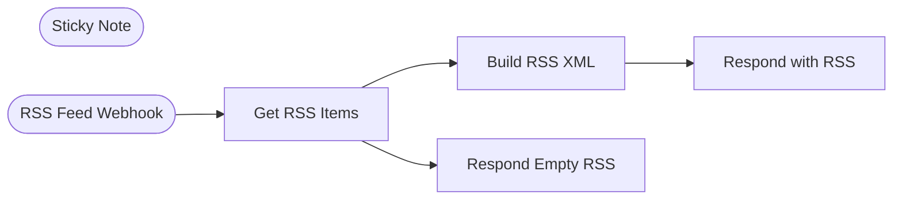

# StackSignal RSS Feed Server

Serves a live RSS feed of queued newsletter drafts over a webhook, so Beehiiv (or any RSS-polling tool) can pull drafts straight out of your Baserow content queue.

<!-- picker: Turn a Baserow content queue into a pollable RSS feed -->

## Use Case

[StackSignal Weekly Draft Generator](../stacksignal-weekly-draft-generator/) and [StackSignal Manual RSS Push](../stacksignal-manual-rss-push/) both queue drafts into a Baserow table — this workflow is the read side. It exposes a stable webhook URL that returns a standards-compliant RSS 2.0 feed of the last 7 days of queued items, filtered by publish date. Point Beehiiv's RSS-to-post automation at it and new drafts show up there automatically.

## Required Credentials

- **Baserow API Token** — read access to your RSS-items queue table

## Node Overview

| Node | Type | Purpose |
|------|------|---------|
| Sticky Note | `n8n-nodes-base.stickyNote` | Documents that the webhook path must stay stable — Beehiiv polls it |
| RSS Feed Webhook | `n8n-nodes-base.webhook` | GET endpoint Beehiiv polls |
| Get RSS Items | `n8n-nodes-base.baserow` | Fetches all rows from the content queue table |
| Build RSS XML | `n8n-nodes-base.code` | Filters to the last 7 days, builds RSS 2.0 XML |
| Respond with RSS | `n8n-nodes-base.respondToWebhook` | Returns the XML with the correct content type |
| Respond Empty RSS | `n8n-nodes-base.respondToWebhook` | Returns a valid empty feed if the Baserow fetch fails |

## Flow Diagram

<!-- FLOW_DIAGRAM:START -->

<!-- FLOW_DIAGRAM:END -->

## Configuration

After importing:

1. **Get RSS Items** — replace `REPLACE_WITH_YOUR_BASEROW_TABLE_ID` with your content-queue table's ID; ensure the table has columns matching `title`, `guid`, `pub_date`, `body_html`, `featured_image_url` (the field names the Code node reads)
2. **RSS Feed Webhook** — copy the webhook URL after importing and activating; keep the path (`stacksignal-rss-feed`) stable once you've registered it with Beehiiv — changing it means reconfiguring Beehiiv's RSS integration
3. In Beehiiv: **Settings → Integrations → RSS** → paste the webhook URL
4. Connect the Baserow credential

## Example

**Request:** `GET https://your-n8n.com/webhook/stacksignal-rss-feed`

**Result:** An `application/rss+xml` response containing one `<item>` per queue row published in the last 7 days — title, GUID, pub date, and HTML body, plus an `<enclosure>` if a featured image URL is set. Beehiiv polls this on its own schedule and creates a draft post per new item.
