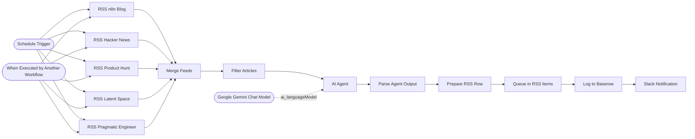

# StackSignal Weekly Draft Generator

Every Sunday evening, pulls the week's top posts from five RSS feeds, has an AI agent curate and write editorial takes on the 3–5 most relevant items, and queues a pre-populated newsletter draft for a human to finish.

<!-- picker: Auto-generate a curated weekly newsletter draft -->

## Use Case

For a solo newsletter operator, the blank-page problem is the biggest weekly time sink. This workflow does the research and first-draft curation automatically: it reads five industry RSS feeds, filters to the last 7 days, asks an AI agent to pick the best items and write an opinionated one-line take on each plus three subject-line options, then writes the draft into your content queue and pings Slack when it's ready to finish. It also exposes an `Execute Workflow` entry point so another workflow can trigger it on demand, not just on the Sunday schedule.

## Required Credentials

- **Google Gemini API** — the AI Agent's language model (curation + subject lines)
- **Baserow API Token** — write access to your draft/RSS-items table
- **Slack OAuth2** — post the "draft ready" notification

## Node Overview

| Node | Type | Purpose |
|------|------|---------|
| Schedule Trigger | `n8n-nodes-base.scheduleTrigger` | Fires Sunday 18:00 |
| When Executed by Another Workflow | `n8n-nodes-base.executeWorkflowTrigger` | Lets another workflow trigger this one on demand |
| RSS n8n Blog | `n8n-nodes-base.rssFeedRead` | Reads the n8n blog feed |
| RSS Hacker News | `n8n-nodes-base.rssFeedRead` | Reads the Hacker News feed |
| RSS Product Hunt | `n8n-nodes-base.rssFeedRead` | Reads the Product Hunt feed |
| RSS Latent Space | `n8n-nodes-base.rssFeedRead` | Reads the Latent Space feed |
| RSS Pragmatic Engineer | `n8n-nodes-base.rssFeedRead` | Reads the Pragmatic Engineer feed |
| Merge Feeds | `n8n-nodes-base.merge` | Combines all 5 feeds into one list |
| Filter Articles | `n8n-nodes-base.code` | Keeps items published in the last 7 days |
| AI Agent | `@n8n/n8n-nodes-langchain.agent` | Curates 3–5 items, writes takes + subject-line options |
| Google Gemini Chat Model | `@n8n/n8n-nodes-langchain.lmChatGoogleGemini` | Language model backing the AI Agent |
| Parse Agent Output | `n8n-nodes-base.code` | Parses the agent's JSON into structured fields + a Slack summary |
| Prepare RSS Row | `n8n-nodes-base.code` | Shapes the row for the content queue (GUID, pub date, HTML body) |
| Queue in RSS Items | `n8n-nodes-base.baserow` | Inserts the draft into your content queue table |
| Log to Baserow | `n8n-nodes-base.baserow` | Logs the draft as a tracked record (ships **disabled** — enable it if you want this secondary log) |
| Slack Notification | `n8n-nodes-base.slack` | Posts "draft ready" with subject-line options to Slack |

## Flow Diagram

<!-- FLOW_DIAGRAM:START -->

<!-- FLOW_DIAGRAM:END -->

## Configuration

After importing:

1. **RSS nodes** — swap the 5 feed URLs for whatever sources you want curated (industry blogs, competitor newsletters, niche forums)
2. **Google Gemini Chat Model** — connect your Gemini credential; swap `modelName` for another Gemini/OpenAI-compatible model if preferred
3. **Queue in RSS Items** and **Log to Baserow** — replace `REPLACE_WITH_YOUR_BASEROW_TABLE_ID` with your actual table ID, and replace each `REPLACE_WITH_YOUR_..._FIELD_ID` with the numeric field ID from your Baserow table (find it in the table's API docs panel, or via the Baserow API)
4. **Slack Notification** — replace `REPLACE_WITH_YOUR_SLACK_CHANNEL_ID` with your channel's ID
5. **AI Agent** — edit the system prompt's audience description and content themes to match your own newsletter's voice
6. Connect credentials: Google Gemini → "Google AI Studio API", Baserow → "Baserow", Slack → "Slack OAuth 2.0 API"

## Example

**Trigger:** Sunday 18:00, or manually via Execute Workflow

**Result:**
- A new row appears in your Baserow content queue with a pre-filled title, GUID, and an HTML body containing 3 section headers (`THE WORKFLOW`, `THE STACK MOVE`, `THE SIGNAL`) — the first two left as prompts for you to write, the third pre-populated with 3–5 curated items and one-line takes
- Slack receives: _"📝 StackSignal draft ready — Theme: workflow-automation — Subject options: 1. ... 2. ... 3. ... — Signal items: 4 pre-populated → Open Beehiiv to write Workflow + Stack Move sections"_
