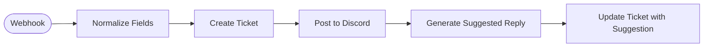

# Support Ticket Alert

Receives a contact/support form submission, creates a Baserow ticket row, posts an alert to Discord, generates an AI-suggested reply with GPT-4o, and saves the suggestion back to the ticket.

<!-- picker: Route support tickets to Discord + AI draft replies -->

## Use Case

Give your support inbox instant visibility and a head start on every reply. The moment a customer submits a support form, your team sees it in Discord, a ticket is created in Baserow, and an AI-drafted reply is already waiting in the ticket record — ready to review, edit, and send.

## Required Credentials

- **Baserow API Key** — write access to your tickets table
- **Discord Webhook** — post access to your support alerts channel
- **OpenAI API Key** — GPT-4o reply generation

## Node Overview

| Node | Type | Purpose |
|------|------|---------|
| Webhook | `n8n-nodes-base.webhook` | Receives POST from contact/support form |
| Normalize Fields | `n8n-nodes-base.set` | Maps form fields to consistent names, defaults `subject` |
| Create Ticket | `n8n-nodes-base.baserow` | Creates a new ticket row with Status = `open` |
| Post to Discord | `n8n-nodes-base.discord` | Posts a formatted alert with ticket details via webhook |
| Generate Suggested Reply | `n8n-nodes-base.openAi` | Writes a draft reply using ticket context |
| Update Ticket with Suggestion | `n8n-nodes-base.baserow` | Saves the AI reply to the `AI Suggested Reply` field |

## Flow Diagram

<!-- FLOW_DIAGRAM:START -->

<!-- FLOW_DIAGRAM:END -->

## Configuration

After importing:

1. **Webhook** — copy the webhook URL and add it as your support form action
2. **Create Ticket + Update Ticket** — replace `YOUR_TICKETS_TABLE_ID` in both Baserow nodes; ensure your table has columns: `Name`, `Email`, `Subject`, `Message`, `Status`, `Created At`, `AI Suggested Reply`
3. **Post to Discord** — create a webhook in your Discord server (**Server Settings → Integrations → Webhooks → New Webhook**) and use its URL for the credential
4. **Generate Suggested Reply** — edit the system prompt with your product/service context for more relevant suggestions
5. Connect credentials: Baserow account (both nodes), Discord Webhook, OpenAI account

## Example

**Form submission:**
```json
{
  "name": "Dimitris K.",
  "email": "dimitris@example.com",
  "subject": "Can't log in to my account",
  "message": "I keep getting an error when I try to log in. It says 'invalid credentials' but I'm sure my password is correct."
}
```

**Discord alert posted:**
> 🎫 **New support ticket #23**
> **From:** Dimitris K. (dimitris@example.com)
> **Subject:** Can't log in to my account
> **Message:** I keep getting an error...

**AI Suggested Reply saved to Baserow:**
> Hi Dimitris, sorry to hear you're having trouble logging in! This is usually caused by a browser-cached session. Please try clearing your cookies or using an incognito window. If that doesn't help, use the "Forgot password" link to reset. Let us know how it goes! — The Support Team
