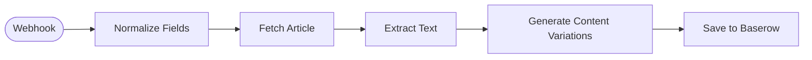

# Content Repurpose Pipeline

Takes an article URL via webhook, scrapes the text, and uses GPT-4o to generate a 5-tweet thread, a LinkedIn post, and a newsletter snippet — all saved to Baserow.

<!-- picker: Repurpose any article into 3 content formats -->

## Use Case

Turn one article into three pieces of ready-to-publish content in under 30 seconds. Send any URL to this webhook from your browser (using a bookmarklet or tool like Raycast) and get a full content set waiting for you in Baserow.

## Required Credentials

- **OpenAI API Key** — GPT-4o content generation
- **Baserow API Key** — write access to your content table

## Node Overview

| Node | Type | Purpose |
|------|------|---------|
| Webhook | `n8n-nodes-base.webhook` | Receives `{ "url": "https://..." }` POST |
| Normalize Fields | `n8n-nodes-base.set` | Pins the `url` field so downstream nodes read from a stable name |
| Fetch Article | `n8n-nodes-base.httpRequest` | Fetches the raw HTML of the article |
| Extract Text | `n8n-nodes-base.code` | Strips HTML tags, collapses whitespace, truncates to 4000 chars |
| Generate Content Variations | `n8n-nodes-base.openAi` | Returns structured JSON with tweet_thread, linkedin_post, newsletter_snippet |
| Save to Baserow | `n8n-nodes-base.baserow` | Creates a row with all three outputs as separate fields |

## Flow Diagram

<!-- FLOW_DIAGRAM:START -->

<!-- FLOW_DIAGRAM:END -->

## Configuration

After importing:

1. **Webhook node** — copy the webhook URL; trigger it by sending: `curl -X POST https://your-n8n.com/webhook/repurpose-content -H "Content-Type: application/json" -d '{"url":"https://example.com/article"}'`
2. **Save to Baserow** — replace `REPLACE_WITH_YOUR_BASEROW_TABLE_ID`; ensure the table has fields: `Source URL`, `Status`, `Created`, `Tweet Thread`, `LinkedIn Post`, `Newsletter Snippet` (all except `Status`/`Created` as long text)
3. **Generate Content Variations** — edit the system prompt to adjust tone, format, or add brand-specific instructions
4. Connect OpenAI and Baserow credentials

## Example

**Input webhook body:**
```json
{ "url": "https://hbr.org/2026/04/why-small-businesses-automate-first" }
```

**Baserow row created with:**
- **Tweet Thread:** 5 tweets, tweet 1 = hook, tweet 5 = CTA
- **LinkedIn Post:** 180-word professional post with hashtags
- **Newsletter Snippet:** 90-word teaser paragraph
