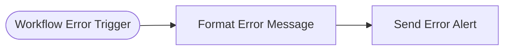

# Error Handler

Centralized error handler for all other workflows in this library. When any workflow fails, n8n routes the error here and posts an alert to Discord.

<!-- picker: Get alerted when any workflow fails -->

## Use Case

Set this as the `errorWorkflow` in every other workflow's settings. Instead of silent failures, every error posts a Discord message with the workflow name, the failing node (or a trigger-error marker if the workflow never actually started), the error message, and a link to the execution when one exists — giving you immediate visibility when something breaks.

## Required Credentials

- **Discord Webhook** — post access to your ops/alerts channel

## Node Overview

| Node | Type | Purpose |
|------|------|---------|
| Workflow Error Trigger | `n8n-nodes-base.errorTrigger` | Fires when any linked workflow encounters an error |
| Format Error Message | `n8n-nodes-base.code` | Builds one Discord message from the error context — branches on whether the failure happened mid-execution (node + execution link) or at trigger time (no execution ever started) |
| Send Error Alert | `n8n-nodes-base.discord` | Posts the formatted error alert to Discord via webhook |

## Flow Diagram

<!-- FLOW_DIAGRAM:START -->

<!-- FLOW_DIAGRAM:END -->

## Configuration

1. **Import and activate this workflow first**, before activating any others.
2. **Copy this workflow's ID.** After importing, open the workflow in n8n, check the URL — the ID is the string after `/workflow/`. Copy it.
3. **Update all other workflows.** In each workflow's **Settings** panel (⚙ icon, top-right of the editor), set **Error Workflow** to the ID you copied.
4. **Send Error Alert** — create a webhook in your Discord server (**Server Settings → Integrations → Webhooks → New Webhook**) and use its URL for the credential.
5. Connect the Discord Webhook credential.

## Example

**When Invoice Reminder fails on the Baserow node:**

```
🔴 Invoice Reminder
📍 Get Unpaid Invoices
Could not connect to Baserow — ECONNREFUSED
🔗 https://your-n8n.example.com/execution/workflow/3/8472
```

**When a workflow fails before it ever starts** (e.g. a misconfigured trigger), there's no node or execution link yet, so the marker line instead reads `⚡ trigger error (webhook)`.
